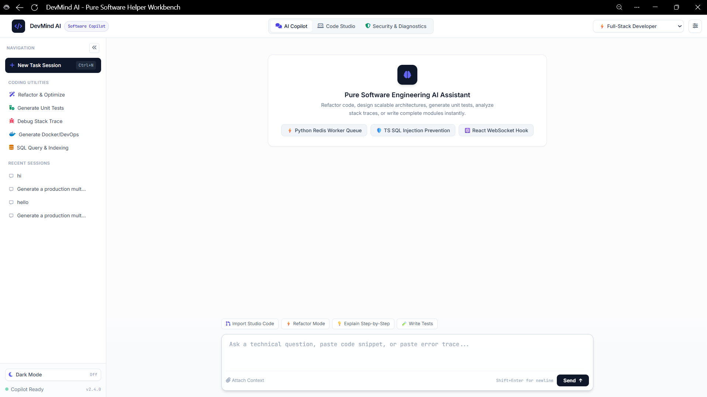
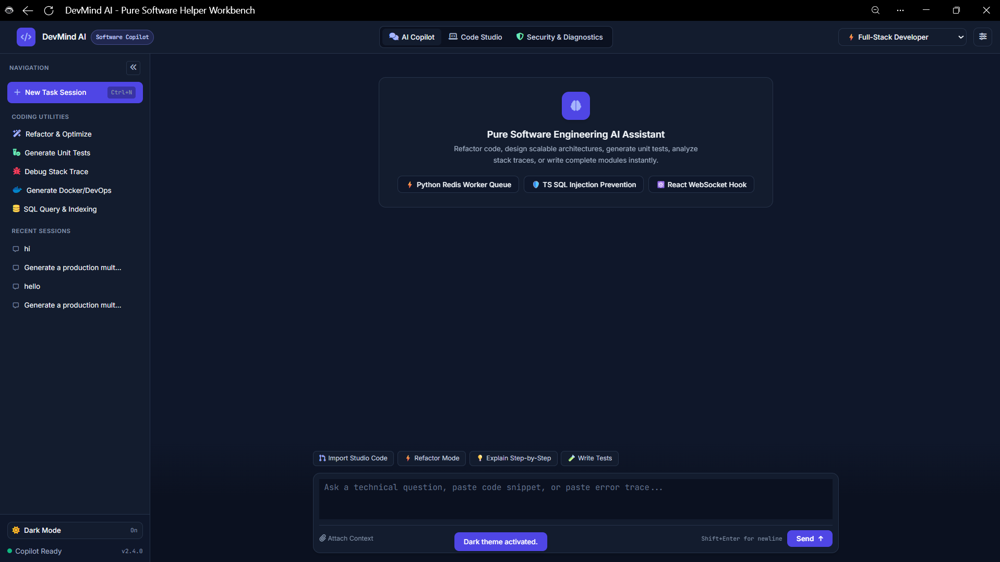

# DevMind AI

An AI software-engineering workbench: a streaming chat copilot, a code studio that runs your code, and an AI-powered security audit. The frontend is a single HTML page, and **all of its data comes from an Express backend** that talks to the Google Gemini API.

| Light theme | Dark theme |
|---|---|
|  |  |

## Features

- **AI Copilot** – chat with Gemini, streamed word by word. Pick a persona (Full-Stack Developer, Software Architect, Security & SecOps Lead, Clean Code Guru), attach a file as context, and use one-click utilities (Refactor, Unit Tests, Debug, Docker/DevOps, SQL & Indexing).
- **Code Studio** – write JavaScript or Python and run it on the server with a 5-second timeout. Send the code to the copilot for analysis in one click.
- **Security & Diagnostics** – Gemini reviews pasted code for OWASP-style vulnerabilities, resource leaks and performance problems. Deterministic pattern rules (hardcoded secrets, `eval`, SQL string concatenation, weak hashes, ...) run alongside it, and everything is combined into a health score with line numbers and fixes.
- **Persistent chat history** – sessions are stored on the server. Delete any chat with the trash icon that appears on hover.
- **Light and dark themes** – the choice, persona and settings are saved on the server.
- **Resilient AI calls** – retries once, then falls back to a second Gemini model when the main one is overloaded (503/429).

## How it works

```
Browser (public/index.html)  ──fetch / SSE──▶  Express (server.js)  ──▶  Gemini API
                                                  ├─ src/config.js   UI data: personas, prompts, labels, defaults
                                                  ├─ src/ai.js       streaming chat + AI audit, retry/fallback
                                                  ├─ src/audit.js    pattern-rule scanner + scoring
                                                  ├─ src/runner.js   sandbox-less code runner (child process)
                                                  └─ src/store.js    sessions + settings in data/db.json
```

The page contains no hardcoded content. On load it calls `GET /api/bootstrap` and builds the personas, starter prompts, sidebar, languages, settings and chat list from the response.

## Quick start

Requires **Node.js 18 or newer** and a free Gemini API key from <https://aistudio.google.com/apikey>.

```bash
npm install
cp .env.example .env      # Windows: copy .env.example .env
# open .env and paste your key after GEMINI_API_KEY=
npm start
```

Open **http://localhost:3000**. Always use this address rather than opening the HTML file directly. The startup line shows `AI: Gemini gemini-2.5-flash` when the key was loaded, or `NOT CONFIGURED` when it was not. You can also check `http://localhost:3000/api/health`.

For development with auto-restart: `npm run dev`.

## Configuration (`.env`)

| Variable | Default | Description |
|---|---|---|
| `GEMINI_API_KEY` | – | **Required.** Your Gemini API key. Keep it only on the server. |
| `GEMINI_MODEL` | `gemini-2.5-flash` | Main model. |
| `GEMINI_FALLBACK_MODELS` | `gemini-2.5-flash-lite` | Comma-separated models tried when the main one is overloaded. Empty disables the fallback. |
| `GEMINI_THINKING_BUDGET` | `0` | `0` = fastest, `-1` = dynamic (smarter, slower), or a token count. Applies to 2.5 Flash models. |
| `PORT` | `3000` | Server port. |
| `ENABLE_CODE_EXEC` | `true` (dev), `false` when `NODE_ENV=production` | Allows Code Studio to run code on the server. |
| `CORS_ORIGIN` | `*` in dev, off in production | Set to your site's origin if the page is served from somewhere else. |
| `DB_FILE` | `data/db.json` | Where sessions and settings are stored. |

## API

| Method | Endpoint | Purpose |
|---|---|---|
| GET | `/api/bootstrap` | Everything the UI needs on load |
| GET | `/api/health` | Is the AI key loaded? |
| GET / PUT | `/api/settings` | System prompt, temperature, engine, theme, persona |
| GET | `/api/sessions` | List chats |
| GET / DELETE | `/api/sessions/:id` | Read or delete one chat |
| POST | `/api/chat/stream` | Chat reply as Server-Sent Events (`{delta}` … `{done}` / `{error}`) |
| POST | `/api/chat` | Same, non-streaming |
| POST | `/api/studio/run` | Run JavaScript or Python (`{ language, code }`) |
| POST | `/api/audit` | AI + rule-based security audit (`{ code }`) |

## Project structure

```
devmind-ai/
├── server.js            # Express app and routes
├── package.json
├── .env.example         # copy to .env and add your key
├── public/index.html    # the frontend
├── src/                 # config, ai, audit, runner, store
├── docs/                # screenshots used in this README
└── data/                # created at runtime (chat history), git-ignored
```

## Security notes

- **Never commit `.env`.** It is in `.gitignore`. If a key is ever pushed, create a new one and delete the old one.
- **Code Studio is not a real sandbox.** It runs code in a child process with a timeout, but that code can still read files on the server. Use it locally only, or run the server inside a locked-down Docker container. Set `ENABLE_CODE_EXEC=false` to turn it off. The Gemini key is removed from the child process environment.
- **There is no login.** All visitors share the same chats and settings, so don't expose the server publicly as is.
- Chat output is sanitized with DOMPurify before it is rendered.
- AI audits and answers can be wrong. Treat findings as a review aid, not a guarantee.

## Troubleshooting

| Symptom | Fix |
|---|---|
| `Failed to fetch` / "Cannot reach the backend" | The server isn't running, or you opened the HTML file directly. Run `npm start` and open `http://localhost:3000`. |
| `GEMINI_API_KEY is not set` | Put the key in `.env` next to `server.js` (no quotes, no spaces) and restart the server. |
| `Gemini API 503 … high demand` | Temporary overload. The server retries and uses the fallback model automatically. |
| Replies feel slow or shallow | Speed and depth trade off. Raise `GEMINI_THINKING_BUDGET` for deeper answers, or keep `0` for speed. |
| Python won't run | Install Python 3 (`python3` on macOS/Linux, `python` on Windows) and make sure it is on the PATH. |

## License

Add the license of your choice (for example MIT).
